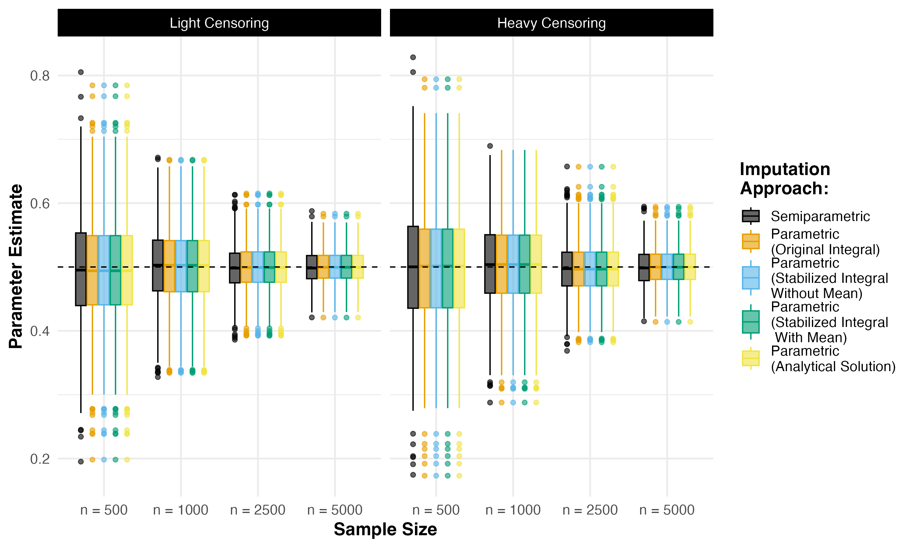
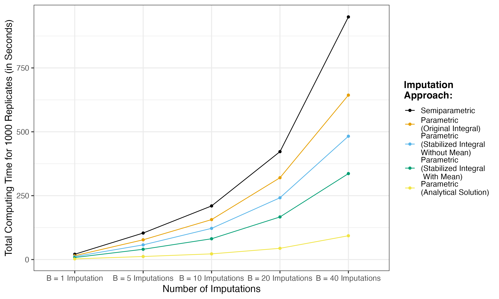

```{r setup, include=FALSE}
knitr::opts_chunk$set(echo = TRUE)
```

This repository contains R code and simulation data to reproduce results from the [manuscript]() by Sarah C. Lotspeich and Ethan M. Alt (2023+). 

## Package Installation

Installation of the `speedyCMI` from GitHub requires the
[`devtools`](https://www.r-project.org/nosvn/pandoc/devtools.html)
package and can be done in the following way.

```{r, eval = FALSE}
# Install the package
devtools::install_github(repo = "sarahlotspeich/speedyCMI", 
                         ref = "main")
```

The package can then be loaded in the usual way. 

```{r, warning = FALSE, message = FALSE}
# Load the package
library(speedyCMI)
```

## Functions 

The `speedyCMI` package contains separate functions to run conditional mean imputation (CMI) for censored covariates using the different formulas discussed in the corresponding paper. Using the following simulated dataset, we provide a brief overview of these functions and their use below. 

```{r}
set.seed(918) # For reproducibility
n = 1000 # Sample size
z = rbinom(n = n, size = 1, prob = 0.5) # Uncensored covariate
x = rweibull(n = n, shape = 0.75, scale = 0.25 + 0.25 * z)  # To-be-censored covariate
e = rnorm(n = n, mean = 0, sd = 1) # Random errors
y = 1 + 0.5 * x + 0.25 * z + e # Continuous outcome
q = 0.5 # Rate parameter for censoring
c = rexp(n = n, rate = q) # Random censoring mechanism
w = pmin(x, c) # Observed covariate value
d = as.numeric(x <= c) # "Event" indicator
dat = data.frame(x, z, w, y, d) # Construct data set
head(dat) # Inspect data set
```

The functions are first introduced for single imputation, before providing an example with multiple imputation. 

### 1. Parametric CMI (Original Integral)

```{r}
# Single parametric CMI using the original integral formula
imp_dat = cmi_fp_original(imputation_formula = Surv(time = w, event = d) ~ z,
                          dist = "weibull",
                          W = "w",
                          Delta = "d",
                          data = dat)

## Inspect the return object (list)
head(imp_dat$imputed_data) ### completed dataset with new column "imp" 
imp_dat$code ### logical indicator for whether or not imputation model converged

## Fit the analysis model to singly imputed data
lm(y ~ imp + z, 
   data = imp_dat$imputed_data)
```

### 2. Parametric CMI (Stabilized Integral Without Mean)

```{r}
# Single parametric CMI using the stabilized integral formula without mean
imp_dat = cmi_fp_stabilized(imputation_formula = Surv(time = w, event = d) ~ z,
                            dist = "weibull",
                            W = "w",
                            Delta = "d",
                            data = dat, 
                            with_mean = FALSE)

## Fit the analysis model to singly imputed data
lm(y ~ imp + z, 
   data = imp_dat$imputed_data)
```

### 3. Parametric CMI (Stabilized Integral With Mean)

```{r}
# Single parametric CMI using the stabilized integral formula with mean
imp_dat = cmi_fp_stabilized(imputation_formula = Surv(time = w, event = d) ~ z,
                            dist = "weibull",
                            W = "w",
                            Delta = "d",
                            data = dat, 
                            with_mean = TRUE)

## Fit the analysis model to singly imputed data
lm(y ~ imp + z, 
   data = imp_dat$imputed_data)
```

### 4. Parametric CMI (Analytical Solution)

```{r}
# Single parametric CMI using the analytical solution
imp_dat = cmi_fp_analytical(imputation_formula = Surv(time = w, event = d) ~ z,
                            dist = "weibull",
                            W = "w",
                            Delta = "d",
                            data = dat)

## Fit the analysis model to singly imputed data
lm(y ~ imp + z, 
   data = imp_dat$imputed_data)
```

### 6. Parametric CMI (Multiple Imputation)

Using the analytical solution as our example, the following code snippet outlines how the use of the `cmi_fp_analytical()` function can be modified for multiple imputation via bootstrap resampling. Notice that the first modification is in supplying the desired number of imputations to the `boots` argument. 

```{r}
# Multiple parametric CMI using the analytical solution
B = 20 ## Desired number of imputations 
mult_imp = cmi_fp_analytical(imputation_formula = Surv(time = w, event = d) ~ z, 
                             dist = "weibull",
                             W = "w", 
                             Delta = "d", 
                             data = dat, 
                             boots = B) 

## Inspect the return object (list of lists)
head(mult_imp[[1]]$imputed_data) ### completed dataset with new column "imp" from imputation 1
mult_imp[[1]]$code ### logical indicator for whether or not imputation model converged from imputation 1

## Fit the analysis model to multiplt imputed data
cmi_fp_pool_fit(formula = y ~ imp + z, 
                imp_data = mult_imp)
```

## Figures 

**Figure 1.** Average computing runtime per-replication for single imputation simulations (in seconds). The solid and dashed lines connect the mean and median per-replicate computing times, respectively.


  - [Script (Run Simulations)](sims/single-imputation-sims.R)
  - [Script (Make Figure)](figures/fig1-average-computing-time-weibull-single-imp.R)
  - [Data (Simulation Results)](sims/single-imputation-sims.csv)

**Figure 2.** Estimates of $\beta_1$, the parameter on the censored covariate $X$ in the linear regression analysis model, resulting from each single imputation approach. The horizontal dashed line denotes the true value of $\beta_1 = 0.5$. 



  - [Script (Run Simulations)](sims/single-imputation-sims.R)
  - [Script (Make Figure)](figures/fig2-betas-weibull-single-imp.R)
  - [Data (Simulation Results)](sims/single-imputation-sims.csv)

**Figure 3.** Average computing runtime per-replication for imputation simulations (in seconds) with an increasing number of imputations $B$. The solid and dashed lines connect the mean and median per-replicate computing times, respectively.


  - [Script (Run Simulations)](sims/multiple-imputation-sims.R)
  - [Script (Make Figure)](figures/fig3-average-computing-time-weibull-multiple-imp.R)
  - [Data (Simulation Results)](sims/multiple-imputation-sims.csv)

**Figure 4.** Estimates of $\beta_1$, the parameter on the censored covariate $X$ in the linear regression analysis model, resulting from each imputation approach with an increasing number of imputations $B$. The horizontal dashed line denotes the true value of $\beta_1 = 0.5$.


  - [Script (Run Simulations)](sims/multiple-imputation-sims.R)
  - [Script (Make Figure)](figures/fig4-betas-weibull-multiple-imp.R)
  - [Data (Simulation Results)](sims/multiple-imputation-sims.csv)

**Figure S1.** Total computing runtime across 1000 replicates for single imputation simulations (in seconds). 


  - [Script (Run Simulations)](sims/single-imputation-sims.R)
  - [Script (Make Figure)](figures/figS1-total-computing-time-weibull-single-imp.R)
  - [Data (Simulation Results)](sims/single-imputation-sims.csv)

**Figure S2.** Total computing runtime across 1000 replicates for imputation simulations (in seconds) with an increasing number of imputations $B$. 



  - [Script (Run Simulations)](sims/multiple-imputation-sims.R)
  - [Script (Make Figure)](figures/figS2-total-computing-time-weibull-multiple-imp.R)
  - [Data (Simulation Results)](sims/multiple-imputation-sims.csv)
