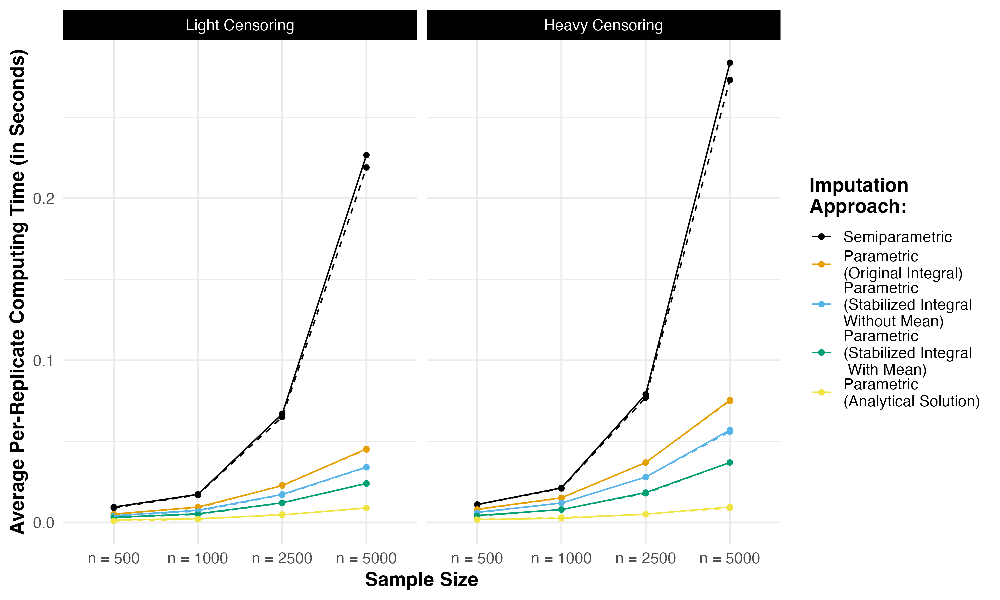

# Statistically and computationally efficient conditional mean imputation for censored covariates

This repository contains R code and simulation data to reproduce results from the [manuscript]() by Sarah C. Lotspeich and Ethan M. Alt (2023+). 

## Package Installation

Installation of the `speedyCMI` from GitHub requires the
[`devtools`](https://www.r-project.org/nosvn/pandoc/devtools.html)
package and can be done in the following way.

``` r
# Install the package
devtools::install_github(repo = "sarahlotspeich/speedyCMI")
```

## Functions 

The `speedyCMI` package contains separate functions to run conditional mean imputation (CMI) for censored covariates using the different formulas discussed in the corresponding paper. Using the following simulated dataset, 

``` r
set.seed(918) # For reproducibility
n = 1000 # Sample size
z = rbinom(n = n, size = 1, prob = 0.5) # Uncensored covariate
x = rweibull(n = n, shape = 0.75, scale = 0.25 + 0.25 * z)  # To-be-censored covariate
e = rnorm(n = n, mean = 0, sd = 1) # Random errors
y = 1 + 0.5 * x + 0.25 * z + e # Continuous outcome
q = 0.5 # Rate parameter for censoring
c = rexp(n = n, rate = q) # Random censoring mechanism
w = pmin(x, c) # Observed covariate value
d = as.numeric(x <= c) # "Event" indicator
dat = data.frame(x, z, w, y, d) # Construct data set
```

we provide a brief overview of these functions and their use below. 

## Figures 

**Figure 1.** Average computing runtime per-replication for single imputation simulations (in seconds). The solid and dashed lines connect the mean and median per-replicate computing times, respectively.



  - [Script (Run Simulations)](sims/single-imputation-sims.R)
  - [Script (Make Figure)](figures/fig1-average-computing-time-weibull-single-imp.R)
  - [Data (Simulation Results)](sims/single-imputation-sims.csv)

**Figure 2.** Estimates of $\beta_1$, the parameter on the censored covariate $X$ in the linear regression analysis model, resulting from each single imputation approach. The horizontal dashed line denotes the true value of $\beta_1 = 0.5$. 


  - [Script (Run Simulations)](sims/single-imputation-sims.R)
  - [Script (Make Figure)](figures/fig2-betas-weibull-single-imp.R)
  - [Data (Simulation Results)](sims/single-imputation-sims.csv)

**Figure 3.** Average computing runtime per-replication for imputation simulations (in seconds) with an increasing number of imputations $B$. The solid and dashed lines connect the mean and median per-replicate computing times, respectively.


  - [Script (Run Simulations)](sims/multiple-imputation-sims.R)
  - [Script (Make Figure)](figures/fig3-average-computing-time-weibull-multiple-imp.R)
  - [Data (Simulation Results)](sims/multiple-imputation-sims.csv)

**Figure 4.** Estimates of $\beta_1$, the parameter on the censored covariate $X$ in the linear regression analysis model, resulting from each imputation approach with an increasing number of imputations $B$. The horizontal dashed line denotes the true value of $\beta_1 = 0.5$.


  - [Script (Run Simulations)](sims/multiple-imputation-sims.R)
  - [Script (Make Figure)](figures/fig4-betas-weibull-multiple-imp.R)
  - [Data (Simulation Results)](sims/multiple-imputation-sims.csv)

**Figure S1.** Total computing runtime across 1000 replicates for single imputation simulations (in seconds). 


  - [Script (Run Simulations)](sims/single-imputation-sims.R)
  - [Script (Make Figure)](figures/figS1-total-computing-time-weibull-single-imp.R)
  - [Data (Simulation Results)](sims/single-imputation-sims.csv)

**Figure S2.** Total computing runtime across 1000 replicates for imputation simulations (in seconds) with an increasing number of imputations $B$. 


  - [Script (Run Simulations)](sims/multiple-imputation-sims.R)
  - [Script (Make Figure)](figures/figS2-total-computing-time-weibull-multiple-imp.R)
  - [Data (Simulation Results)](sims/multiple-imputation-sims.csv)
